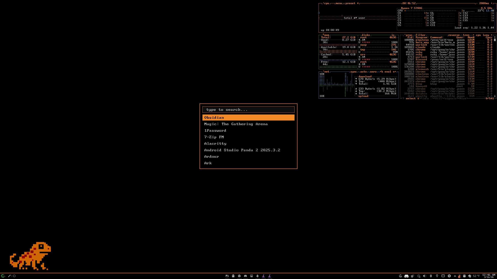

# Salamander

A KDE Plasma 6 desktop theme with an orange/black retro IBM aesthetic.

## Features

- Black panel with a 2px orange top-edge accent line
- Orange bottom-bar active window indicator
- No background tint on focused task icons
- Dark color scheme with orange highlights throughout

## Installation

### Manual

1. Copy the `salamander` folder to `~/.local/share/plasma/desktoptheme/`
2. Open System Settings > Colors & Themes > Plasma Style
3. Select Salamander and apply

### KDE Store

Search for "Salamander" in System Settings > Colors & Themes > Plasma Style > Get New Plasma Styles

## Wallpaper

The wallpaper shown in the preview (`wallpaper-4k.png`) is included in the repo and on the KDE Store download.

## Colors

| Role | Hex |
|---|---|
| Background | `#000000` |
| Primary orange | `#f28927` |
| Green accent | `#39803e` |
| Text | `#aaaaaa` |

## License

CC-BY-SA 4.0 - hollerknight
